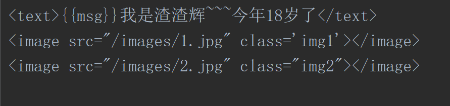

# wx1  
第一次用微信web开发工具搭建了第一个测试的微信简单小页面  
部分代码展示：  
   ```
   app.json(必须有)
        {
          "pages":[
            "pages/test1/test1"
          ],
          "window": {
            "navigationBarBackgroundColor": "#000",
            "navigationBarTextStyle": "white",
            "navigationBarTitleText": "我的第一个微信小程序"
          }
        } 
  ```  
  ```$xslt 
    app.js(必须有)  
        App({
          onLaunch: function (options) {
            // Do something initial when launch.
          },
          onShow: function (options) {
            // Do something when show.
          },
          onHide: function () {
            // Do something when hide.
          },
          onError: function (msg) {
            console.log(msg)
          },
          globalData: 'I am global data'
        }) 
 ```      
  ````
  test1.js(微信逻辑层)  
      Page({
            /**
             * 页面的初始数据
             */
            data: {
              msg:"大家好，"
          
            },
            /**
             * 生命周期函数--监听页面加载
             */
            onLoad: function (options) {
              console.log("在页面空白，加载之前需要先执行我这里面的内容~~");
              setTimeout(() => {
                this.setData({
                  msg: "阿里哈撒哟，"
                })
              }, 2000)
            },
       })
 ````    
test1.wxml   
 
     
      
页面截屏图：  
     
     
   